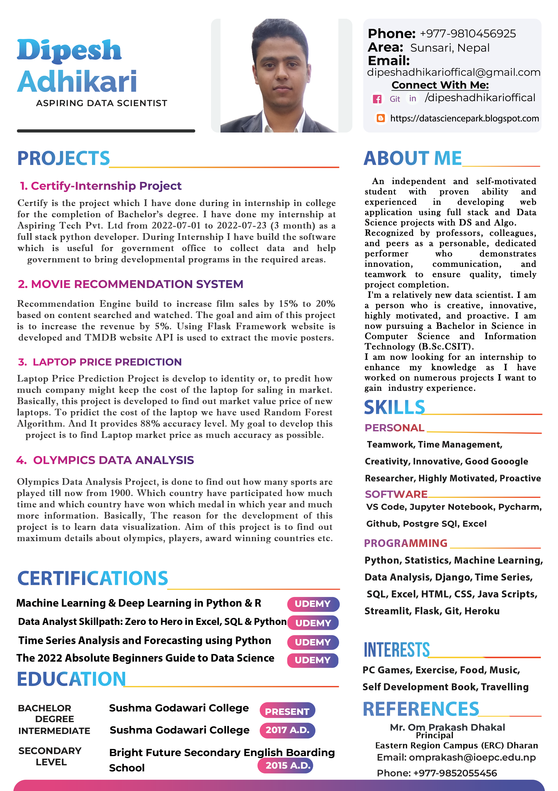

<h1 align="center">Hi , I'm Dipesh Adhikari </h1>
<h3 align="center">I'm a passionate Aspirant Data Scientist.</h3>

## 🙋‍♂️ About Me

- 🔭 I’m currently working on **[ Data Science Projects]()**

- 🌱 I’m currently learning **Data Science**

- 👯 I’m looking to collaborate on **OpenSource Projects**

<!-- - 👨‍💻 All of my projects are available at **[My Portfolio](https://dipeshadhikari.tk)**  -->

- 📫 How to reach me **dipeshadhikariofficial@gmail.com**

- ⚡ Fun fact **I love to play games and read self development books.**
-  I have completed projects on Movie Recommendation System, Finance Personal Dashboard Using Power BI, Laptop Price Prediction, Olympic Data Analysis

<!--   for photo -->

## 🚀 Languages and Tools:

 

## 📊 My Overall Projects

1. Movie Recommendation System : https://github.com/dipeshadhikarioffical/movie-recommendation-system

2. Laptop Price Prediction : https://github.com/dipeshadhikarioffical/laptop-price-prediction
3. Olympics Data Analysis : https://github.com/dipeshadhikarioffical/olympics-data-analysis
4. Personal Dashboard :  https://github.com/dipeshadhikarioffical/personal-dashboard

<!--       -->
 

    
  
    

## 📊 My Github Stats

   
    

   
  <b>Note:</b> Top languages is only a metric of the languages my public code consists of and doesn't reflect experience or skill level.

 
 
<!--
</a>
-->
 
 

## Connect with me:

## ❤ Views and Followers

